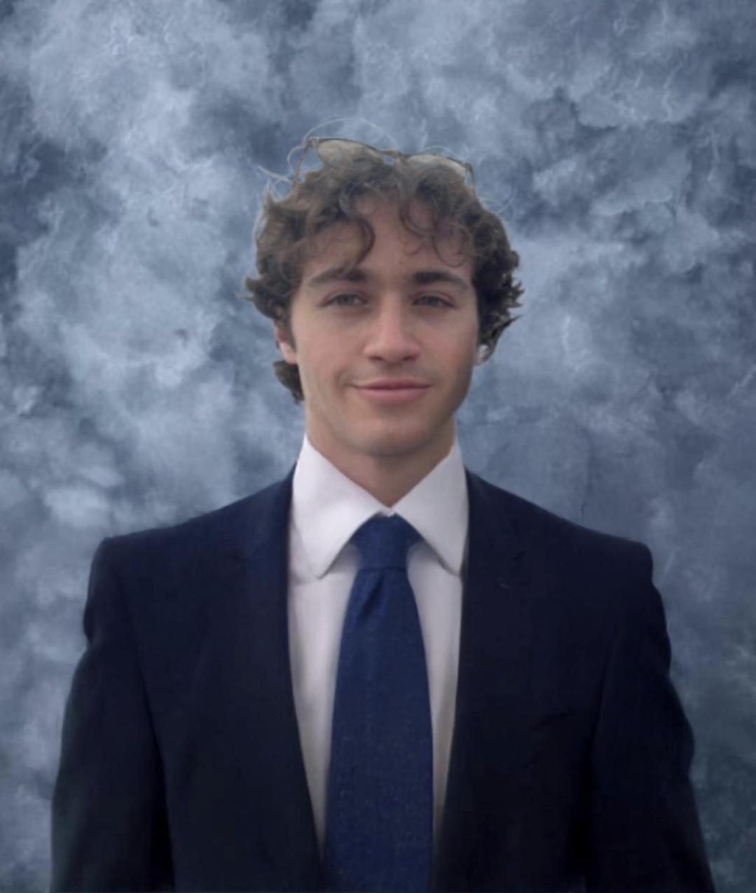

My name is Christian Demierre Cattaneo. I'm Swiss, Italian, American, and Canadian! I speak French, Italian (if we're stretching it), and my personal incomprehensible dialect of Mandarin Chinese.

I grew up in Boston's Little Italy or ["North End"](https://en.wikipedia.org/wiki/North_End,_Boston) and attended [Boston College High School](https://en.wikipedia.org/wiki/Boston_College_High_School) in Dorchester, Mass.

FinTech, social media, and design make me tick. As a result I’ve begun building [hype](https://gethype.webflow.io/), a social media investing app. I came up with this to support and profit off of rising artists, athletes, and influencers using micro-investments instead of likes!

I studied Computer Engineering and Computer Science at [Northeastern University](https://en.wikipedia.org/wiki/Northeastern_University), where I started the Bodybuilding Club. You should judge and roast my natural bodybuilding [here](https://www.instagram.com/zorbbrah/)!

I also enjoy building websites in my spare time, like this one for a [Biomedical company](https://www.ais-imaging.com/).

Thanks for reading! :)

-C
